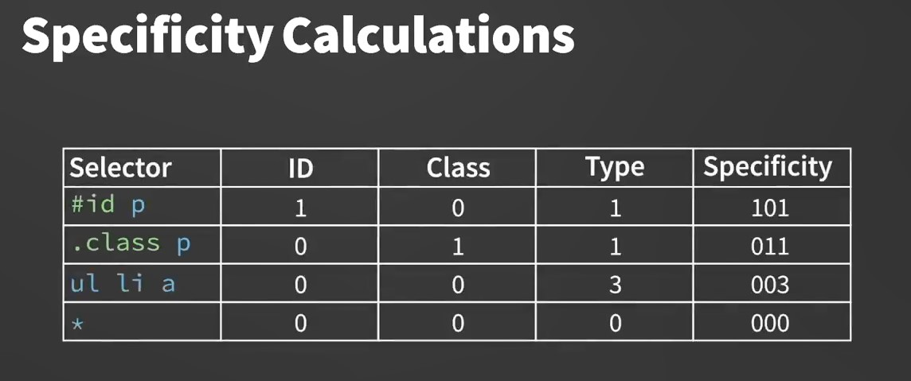
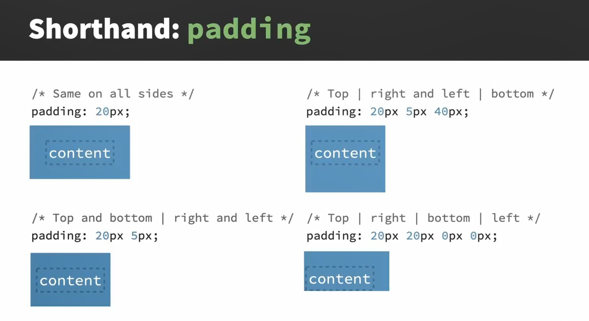
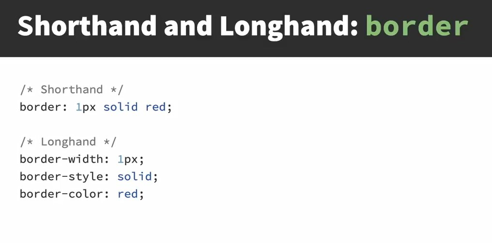
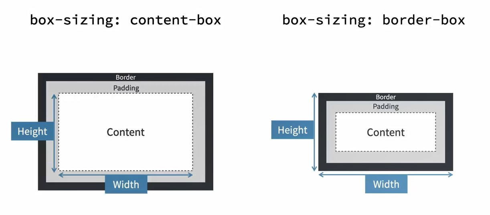

Linkedin CSS Essential Training 08-2023

https://codepen.io/collection/YyadbL

## Links

CSS Essential Training (2023)
https://codepen.io/collection/YyadbL
https://codepen.io/collection/YyadbL

Lorem ipsum   
https://meettheipsums.com/

Photos  
https://unsplash.com/  

Icons  
https://www.iconfinder.com/

https://www.freepik.com/

Изменять размер изображений  
https://www.adobe.com/express/  
https://www.shutterstock.com/  

W3C - Functional Images  
https://www.w3.org/WAI/tutorials/images/functional/

W3C - CSS
https://www.w3.org/Style/CSS/
https://www.w3.org/Style/CSS/Overview.ru.html

https://www.w3.org/Style/CSS/current-work

## 018-The color property and values

Имена цветов

https://developer.mozilla.org/en-US/docs/Web/CSS/named-color

Цвета по группам

https://colours.neilorangepeel.com/

Шестнадцетиричная прозрачность

https://davidwalsh.name/hex-opacity

Как вычислять шестнадцетиричные значения

https://www.wikihow.com/Understand-Hexadecimal

Все типы создания цветов

https://developer.mozilla.org/en-US/docs/Web/CSS/color_value

## 019-Creating a color palette

Выбор набора цветов

https://coolors.co/ -  
Надо нажать кнопку "Start the Generator" и перебирать набор цветов нажатием пробела. Понравившиеся цвета можно отметить неизменными, нажав знак замочка.  

## 026-Project Adding background styles

https://www.webfx.com/web-design/hex-to-rgb/

## 027-Pseudo classes and pseudo elements

https://codepen.io/christinatruong/pen/jOeyPPR

https://developer.mozilla.org/en-US/docs/Web/CSS/:active

## 029-Specificity

Пример высчитывания специфичности



## 032-The box model properties



https://developer.mozilla.org/en-US/docs/Web/CSS/border-width



## 033-Box sizing and the box model fix

Разница в вычислении размера контента:



https://codepen.io/christinatruong/pen/bGxvOeG

`border-box` не изменяет размеры элементов, в отличие от `content-box`.  

Исправление коробочной модели:  

```css
    /*
    https://www.paulirish.com/2012/box-sizing-border-box-ftw/
    */

    html {
    box-sizing: border-box;
    }

    *, *:before, *:after {
    box-sizing: inherit;
    }
```

## 034-Inline block and display

https://codepen.io/christinatruong/pen/xxaYNLK

## 

